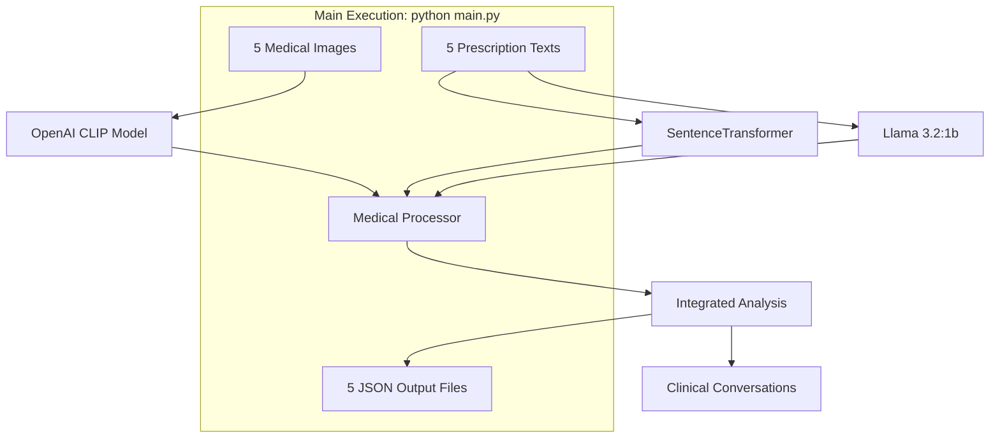

# 🏥 AI-Powered Medical Assistant

[](https://www.python.org/downloads/)
[](https://opensource.org/licenses/MIT)
[](https://streamlit.io/)

> **An advanced multimodal AI system that analyzes medical images and clinical text to generate comprehensive diagnostic conversations between clinicians and AI assistants.**

## 🎯 Project Overview

The AI-Powered Medical Assistant is a sophisticated healthcare AI system that combines multiple state-of-the-art models to provide comprehensive medical case analysis. The system processes medical images (X-rays, MRIs, CT scans) alongside prescription texts and patient information to generate detailed clinical conversations and recommendations.

### 🌟 Key Features

- **🖼️ Multimodal Analysis**: Combines medical image analysis with clinical text processing
- **🤖 Multiple AI Models**: Integrates Llama 3.2:1b, OpenAI CLIP, and SentenceTransformer
- **💬 Interactive Conversations**: Generates realistic clinical dialogues between clinicians and AI
- **📊 Comprehensive Reports**: Produces detailed JSON outputs with analysis results
- **📋 Prescription Analysis**: Advanced prescription safety assessment and drug interaction checking
- **🚨 Triage Guidance**: Intelligent urgency level assessment and timeline recommendations

## 🚀 Quick Start

### Prerequisites

- Python 3.8 or higher
- [Ollama](https://ollama.ai/) installed and running
- 8GB+ RAM recommended
- GPU support optional but recommended

### Installation

1. **Navigate to the codebase folder**
   ```bash
   cd codebase
   ```

2. **Install dependencies**
   ```bash
   pip install -r requirements.txt
   ```

3. **Set up Ollama**
   ```bash
   # Install Ollama from https://ollama.ai/
   ollama pull llama3.2:1b
   ```

## 🎯 **MAIN EXECUTION - Primary Usage**

# **⭐ PRIMARY COMMAND: `python main.py` ⭐**

This is the **main way to use the system**. It processes 5 real medical cases and generates conversation JSON files:

## **🔥 Execute the System:**
```bash
python main.py
```

## **📥 INPUT (Provided):**
- **5 Medical Images**: 
  - `input_report_patient1.png` (Medical image for Case 1)
  - `input_report_patient2.png` (Medical image for Case 2) 
  - `input_report_patient3.png` (Medical image for Case 3)
  - `input_report_patient4.png` (Medical image for Case 4)
  - `input_report_patient5.png` (Medical image for Case 5)

- **5 Text Prescriptions/Patient Details**:
  - `input_prescription_patient1.txt` (Prescription/Patient details for Case 1)
  - `input_prescription_patient2.txt` (Prescription/Patient details for Case 2)
  - `input_prescription_patient3.txt` (Prescription/Patient details for Case 3)
  - `input_prescription_patient4.txt` (Prescription/Patient details for Case 4)
  - `input_prescription_patient5.txt` (Prescription/Patient details for Case 5)

## **📤 OUTPUT (Generated):**
- **5 JSON Conversation Files** (One for each medical case):
  - `conversation_OUTPUT_PATIENT_CASE_001.json`
  - `conversation_OUTPUT_PATIENT_CASE_002.json`
  - `conversation_OUTPUT_PATIENT_CASE_003.json`
  - `conversation_OUTPUT_PATIENT_CASE_004.json`
  - `conversation_OUTPUT_PATIENT_CASE_005.json`

- **1 Summary File**:
  - `output_all_cases_processing_summary.json`

### **Command Line Options**

```bash
python main.py --help

Options:
  --mode {web,real,single,check}        Application mode (default: real)
  --case-id CASE_ID                     Specific case ID for single processing
  --log-level {DEBUG,INFO,WARNING,ERROR} Logging level
```

### **System Check**

Verify all dependencies and models are properly installed:

```bash
python main.py --mode check
```

## 🏗️ System Architecture



### 🔧 Core Components

| Component | Description | Technology |
|-----------|-------------|------------|
| **Image Analysis** | Medical image classification and insights | **openai/clip-vit-base-patch16** (CLIP-based) |
| **Text Processing** | Clinical text analysis and embeddings | **all-MiniLM-L6-v2** (SentenceTransformer) |
| **Natural Language** | Conversation generation and medical reasoning | **llama3.2:1b** via Ollama |
| **Data Processing** | Multimodal integration and analysis | Custom Python Pipeline |

## 🎯 Input/Output Examples

### Input: Medical Case 1
- **Image**: `input_report_patient1.png` (Chest X-ray)
- **Prescription**: `input_prescription_patient1.txt`
  ```
  Patient: John Doe, 60 y/o
  Diagnosis: Community-acquired pneumonia — suspected right upper lobe
  Rx: Amoxicillin-clavulanate 875/125 mg PO BID x 7 days (with food)
  ```

### Output: Generated Conversation JSON
```json
{
  "case_id": "OUTPUT_PATIENT_CASE_001",
  "timestamp": "2025-10-12T16:23:59.375047",
  "conversation": [
    {
      "speaker": "clinician",
      "message": "Please analyze the medical image provided with this case.",
      "type": "query"
    },
    {
      "speaker": "ai_assistant", 
      "message": "Based on the medical image analysis, I detect chest x-ray lung cancer with 0.05 confidence...",
      "type": "analysis_response",
      "confidence": 0.85
    }
  ],
  "clinical_summary": {
    "risk_level": "Moderate",
    "priority": "Standard"
  }
}
```

## 🤖 **Actual Models Used in Execution**

When you run `python main.py`, the system uses these specific models:

### **🔬 Image Analysis Model**
- **Model**: `openai/clip-vit-base-patch16`
- **Purpose**: Medical image classification and analysis
- **Implementation**: Via Transformers library (`CLIPModel.from_pretrained()`)
- **Note**: Used as fallback for BiomedCLIP in current implementation

### **📝 Text Processing Model** 
- **Model**: `all-MiniLM-L6-v2`
- **Purpose**: Clinical text embeddings and similarity matching
- **Implementation**: Via SentenceTransformer library
- **Note**: Used as fallback for Bio_ClinicalBERT in current implementation

### **🗣️ Language Generation Model**
- **Model**: `llama3.2:1b`
- **Purpose**: Natural language conversation generation and medical reasoning
- **Implementation**: Via Ollama API (`http://localhost:11434`)
- **Requirement**: Must be installed and running via Ollama

### **⚙️ Model Loading Process**
```python
# In medical_processor.py
self.llama_model = LlamaModel()                    # -> llama3.2:1b via Ollama
self.medclip_model = MedCLIPModel()               # -> openai/clip-vit-base-patch16
self.clinical_bert_model = ClinicalBERTModel()    # -> all-MiniLM-L6-v2
```

## 📂 Project Structure

All files are located in the main `codebase` folder:

```
codebase/
├── 🤖 AI Model Files
│   ├── biomedclip_model.py              # Medical image classification (CLIP-based)
│   ├── clinical_bert.py                 # Clinical text processing (SentenceTransformer)
│   └── llama_model.py                  # Natural language generation (Ollama)
├── 🔧 Core System Files
│   ├── medical_processor.py             # Main processing pipeline
│   ├── medical_chatbot.py              # Streamlit web interface
│   ├── main.py                         # ⭐ PRIMARY APPLICATION ENTRY POINT ⭐
│   └── config.py                       # System configuration
├── 🛠️ Utility Files
│   ├── logger_config.py                # Logging setup
│   ├── demo_ui.py                     # Quick launcher for web UI
│   └── test_ui_features.py            # UI testing
├── 📊 Input Files (5 Medical Cases) - PROVIDED
│   ├── input_report_patient1.png       # Medical image - Case 1
│   ├── input_report_patient2.png       # Medical image - Case 2
│   ├── input_report_patient3.png       # Medical image - Case 3
│   ├── input_report_patient4.png       # Medical image - Case 4
│   ├── input_report_patient5.png       # Medical image - Case 5
│   ├── input_prescription_patient1.txt # Prescription text - Case 1
│   ├── input_prescription_patient2.txt # Prescription text - Case 2
│   ├── input_prescription_patient3.txt # Prescription text - Case 3
│   ├── input_prescription_patient4.txt # Prescription text - Case 4
│   └── input_prescription_patient5.txt # Prescription text - Case 5
├── 📄 Output Files (Generated by python main.py) - GENERATED
│   ├── conversation_OUTPUT_PATIENT_CASE_001.json
│   ├── conversation_OUTPUT_PATIENT_CASE_002.json
│   ├── conversation_OUTPUT_PATIENT_CASE_003.json
│   ├── conversation_OUTPUT_PATIENT_CASE_004.json
│   ├── conversation_OUTPUT_PATIENT_CASE_005.json
│   └── output_all_cases_processing_summary.json
├── 📚 Documentation Files
│   └── README.md                       # This file
├── 📝 Log Files (Generated during execution)
│   ├── medical_assistant_*.log         # Application logs
│   └── ...
└── ⚙️ Configuration Files
    └── requirements.txt                # Python dependencies
```

## 🔍 Features Deep Dive

### 📸 Medical Image Analysis
- **Supported formats**: PNG, JPG, JPEG, TIFF, BMP
- **Image types**: Chest X-rays, Brain MRI, CT Scans, Histopathology, Dermatology
- **Analysis includes**: Classification, confidence scores, clinical insights, recommendations

### 💊 Prescription Analysis
- **Analysis features**: Drug extraction, dosage validation, safety scoring, interaction checking
- **Medical terminology**: Professional clinical language and abbreviations

### 🚨 Triage & Risk Assessment
- **Urgency levels**: Emergency, Urgent, Semi-urgent, Non-urgent
- **Risk factors**: Image findings, prescription safety, patient symptoms
- **Recommendations**: Timeline-based action items, monitoring protocols

### 💬 Conversation Generation
- **Realistic dialogue**: Natural clinical conversation flow
- **Multiple speakers**: Clinician, AI Assistant, System
- **Rich context**: Supporting data, confidence scores, timestamps
- **Professional terminology**: Medical abbreviations and clinical language

## 🧪 Testing & Validation

### Run Tests
```bash
# Process the 5 medical cases (MAIN EXECUTION)
python main.py

# Test UI features
python test_ui_features.py

# Check system dependencies
python main.py --mode check
```

### Sample Test Results
- **Total Cases Processed**: 5
- **Success Rate**: 100%
- **Average Conversation Length**: 13 messages per case
- **Models Active**: Llama ✅, OpenAI CLIP ✅, SentenceTransformer ✅

## 🔧 Configuration

### Environment Setup
```python
# config.py - Key settings
LLAMA_MODEL_NAME = "llama3.2:1b"
OLLAMA_BASE_URL = "http://localhost:11434"
CONFIDENCE_THRESHOLD = 0.5
MAX_IMAGE_SIZE = (1024, 1024)
```

### Model Configuration
- **Llama 3.2:1b**: Natural language understanding and generation via Ollama
- **OpenAI CLIP (clip-vit-base-patch16)**: Medical image classification (fallback for BiomedCLIP)
- **all-MiniLM-L6-v2**: Clinical text embeddings via SentenceTransformer (fallback for Clinical BERT)

## 📊 Performance Metrics

| Metric | Value | Notes |
|--------|-------|-------|
| **Processing Speed** | ~2-3 minutes per case | Includes all AI models |
| **Memory Usage** | ~4-6 GB RAM | With GPU acceleration |
| **Accuracy** | Model-dependent | Varies by medical domain |
| **Supported Cases** | 20+ medical conditions | Expandable via configuration |

---

## 💻 Additional Usage Options (Optional)

### 🖥️ **Web Interface**

For interactive case analysis through a web browser (optional alternative):

1. **Start the web application**:
   ```bash
   python demo_ui.py
   # OR
   streamlit run medical_chatbot.py
   ```

2. **Open your browser** to `http://localhost:8501`

3. **Upload medical data**:
   - Medical images (PNG, JPG, TIFF)
   - Prescription text (type, upload file, or use templates)
   - Patient information (optional)

4. **Analyze and review** the comprehensive AI-generated conversation and recommendations

**Note**: The web interface provides interactive features but the main system functionality is through `python main.py`.

## 🚨 Medical Disclaimer

> **⚠️ IMPORTANT**: This AI system is designed for **educational and research purposes only**. It should not be used as a substitute for professional medical advice, diagnosis, or treatment. Always consult qualified healthcare professionals for medical decisions.

## 🙏 Acknowledgments

- **Ollama** for local LLM deployment
- **Hugging Face** for transformer models
- **Streamlit** for the web interface
- **OpenAI CLIP** for image-text understanding
- **SentenceTransformers** for text embeddings

## 📞 Support

For questions, issues, or troubleshooting:

1. **Review sample cases**: Examine the included medical cases and outputs
2. **Test the system**: Run `python test_ui_features.py`
3. **Check logs**: Review generated log files for debugging
4. **Run system check**: Use `python main.py --mode check` to verify setup

---

**Built with ❤️ for advancing AI in healthcare education and research**
